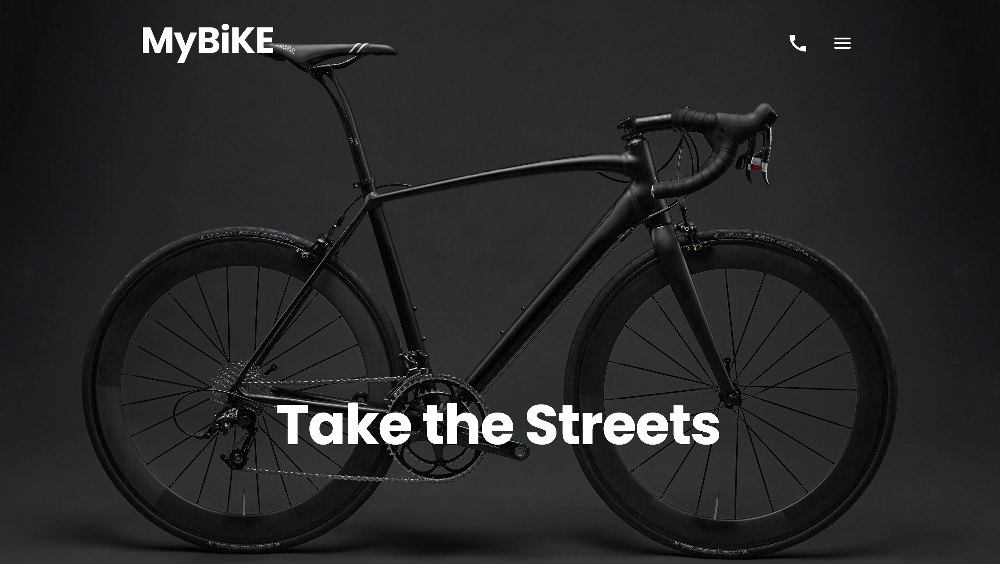

# MyBiKE Landing Page


A modern, highly interactive landing page for a fictional premium bicycle brand, **MyBiKE**. It showcases the bike models, details their features, and provides a sleek, dark-themed user experience with smooth hover animations and responsive design.

## Site Preview



## Technologies Used

- **HTML5** (Semantic markup, BEM methodology)
- **SCSS** (Variables, mixins, responsive layouts)
- **JavaScript** (Interactivity)
- **Parcel** (Fast, zero-configuration web application bundler)
- **Stylelint & Prettier** (Code quality, formatting, and linting)

## Getting Started

Follow these instructions to set up the project locally:

### Clone the repository:

```bash
git clone https://github.com/your-username/my-bike.git
cd my-bike
```

### Install dependencies:

```bash
npm install
```

### Start the development server:

```bash
npm start
```

Open your browser and navigate to `http://localhost:3000`.

## Available Scripts

- `npm start` — Starts the local development server with hot-reloading.
- `npm run build` — Builds an optimized production version into the `dist` folder.
- `npm run format` — Formats all HTML, CSS, and SCSS files using Prettier.
- `npm run lint` — Lints code to catch formatting or styling issues.

## Design

The layout is based on the [MYBIKE landing Figma design](https://www.figma.com/file/NZQAIydtHo5QkINyGLHNcq/BIKE-New-Version?node-id=0%3A1).
